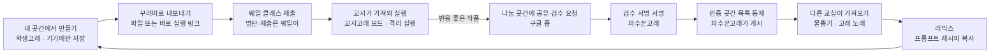

# 고래곳간 PRD

2026-10-01 작성 · 2026-10-03 구현 상태 반영 · 송프로

## 1. 문서 정보와 결정 현황

고래곳간은 로그인 없이 바이브코딩 작품을 '꾸러미'로 주고받고 웨일 사이드패널에서 바로 실행하는 바이브코딩 수업 작품 공유·검수·리믹스 도구입니다. 제품 메시지는 "만들고 끝나는 바이브코딩을, 이어 쓰는 수업으로."입니다. 검수 배지는 '검수 서명' 전자서명으로 위조를 막고, 추천은 파수꾼고래의 '고래 픽'과 누구나 누르는 '물뿜기'로 나뉩니다. 문서 상태는 **MVP 구현 완료 · 공모전 시연 정리 중 (2026-10-03)**입니다. 아래 표와 기능 목록의 상태는 실제 코드와 시험(`npm test`) 기준입니다.

| 항목 | 내용 |
| --- | --- |
| 제품명 | 고래곳간 |
| 버전 | PRD v0.3 (v0.2에 검수 서명 관리자 인증, 추천 시스템, 고래 용어 추가) |
| 출품 | NWEC 2026 웨일 스페이스 수업도구 제안, 분야 1 (수업 지원·학습 활동) |
| 형태 | 웨일 사이드패널 확장앱 + 정적 웹 페이지(인증 곳간 목록, 바로 실행 뷰어, 검수 도구, 웹 버전) + 구글 폼·시트(나눔 곳간 제출, 물뿜기·고래 노래). 고래곳간 자체 서버는 없음 |
| 한 문장 정의 | 사람과 수업 관리는 웨일이, 바이브코딩 작품의 생애주기(찾기 → 안전하게 실행 → 웨일 수업에 공유 → 피드백 → 리믹스 → 다시 활용)는 고래곳간이 맡는 웨일 사이드바 |

| 항목 | 현재 내용 | 상태 |
| --- | --- | --- |
| 이름 | 고래곳간 | 확정 |
| 출품 형태 | Whale Quest와 별도 작품 | 확정 |
| 사용자 | 교사·학생 모두 | 확정 |
| 로그인 | 없음 | 확정 |
| 개인정보 | 고래곳간은 사용자 식별정보(이름·이메일·학교명·전화번호)를 직접 수집·저장하지 않음. 작성자는 닉네임·학교급만. 구글 폼·GitHub Pages 등 외부 서비스의 일반 접속 기록은 각 서비스 정책을 따름 | 확정 |
| 운영 방식 | 파수꾼고래가 검수한 인증 곳간 목록 + 누구나 올리는 나눔 곳간(검수 전) + 가져오기 | 구현 |
| 제출 창구 | 구글 폼 '고래곳간 자료공유' → 응답 시트 → 나눔 곳간 (분류 정보는 설명 칸의 '분류 정보' 글로 보존) | 구현 |
| exe 처리 | 보조 기능. 교사고래만 등록·열람, 파일 보관 없이 링크 + SHA-256 + 소스 저장소 + 검사 결과 + 실행 환경, 검수 서명 확인 시에만 다운로드 링크. 첫 화면·시연 동선에서 제외 | 구현 |
| 웨일 연계 | 웨일 클래스·팀보드·웨일온에 붙여넣기용 글(검수 상태 포함) + 작품 파일 + 바로 실행 링크. UBT는 '평가용 정보 복사'만 (자동 연동 없음) | 구현 |
| 관리자 인증 | 검수 서명: 관리 열쇠 → 고래 족보 → 파수꾼고래 서명, 확장앱이 기기 안에서 검증. 운영 관리 열쇠는 저장소 밖 오프라인 보관 (docs/root-key-setup.md) | 구현 |
| 추천 | 고래 픽(파수꾼고래 서명), 고래 노래(후기), 이달의 고래자리, 물뿜기(익명 설문 집계) | 구현 |
| 물뿜기 집계 | 로그인 없는 구글 설문에 작품 id·교사/학생 구분만 자동 제출 → 응답 시트를 읽어 '교사 N · 학생 M' 표시 | 구현 |
| 서명 방식 | WebCrypto ECDSA P-256 | 구현 |
| 카운터 호스팅 | 없음 (Vercel 카운터 대신 구글 설문 응답 시트) | 변경 |
| 정적 호스팅 | GitHub Pages | 구현 |
| 출품 분야 | 분야 1 | 확정 |
| 구글 폼 세부 설정 | 파일 업로드 문항은 구글 로그인 필요, 응답 시트 공개 범위(공개 전용 탭 권장) | 운영 확인 필요 (docs/google-form.md) |
| UBT 연계 | 공식 API·시험 화면 주소가 확인되지 않아 자동 제출·채점·시험 잠금은 하지 않음. 'UBT 평가용 정보 복사'만 제공 | 확정 (MVP 범위 축소) |

## 2. 문제와 목표

바이브코딩 수업 도구는 늘고 있지만 만든 사람의 드라이브에 갇혀 다른 교실로 건너가지 못하고, 공유 플랫폼은 계정과 개인정보 부담 때문에 학교에 들이기 어렵습니다.

**현재 불편**

1. 결과물이 개인 드라이브·메신저 링크에 흩어져 찾을 수도, 다시 쓸 수도 없습니다.
2. 남의 도구를 쓰려 해도 안전성, 학년 적합성, 사용법을 판단할 근거가 없습니다.
3. 학생 바이브코딩 수업이 '만들고 끝'이라 동료 피드백과 개선 과정이 없습니다.
4. 만든 과정(프롬프트)이 공유되지 않아 다른 교사가 따라 배우기 어렵습니다.
5. 새 플랫폼을 쓰려면 학생 계정 발급과 개인정보 동의가 필요해, 좋은 도구도 학교에 들어오지 못합니다.

**성공 지표 (공모전 기간 기준, 수치는 제안)**

| 지표 | 목표 | 측정 방법 |
| --- | --- | --- |
| 고래곳간이 직접 수집·저장하는 식별정보 항목 | 0개 (작성자는 닉네임·학교급만) | 데이터 흐름 점검표 |
| 시범 학급 학생 작품 제출률 | 참여 학생의 80% 이상 | 웨일 클래스 과제 제출 수 |
| 인증 곳간 등록 작품 | 시범 기간 30건 이상, 그중 학생 작품 5건 이상 | catalog.json 항목 수 |
| 리믹스 작품 비율 | 인증 곳간 작품의 30% 이상 | remixOf 필드 |
| 처음 쓰는 교사의 첫 실행까지 시간 | 설치 후 1분 이내 | 시연 측정 |
| 위험 샘플 탐지 | 테스트 위험 샘플 전부 경고 표시 | 위험 패턴 테스트 세트 |

**심사 기준 대응**

| 심사 항목 | 고래곳간의 답 |
| --- | --- |
| 교육 문제 정의 | 위 5가지 불편을 실제 수업 장면으로 제시 |
| 창의적 접근 | 무로그인·무서버로 작품의 생애주기(만들기·검수·공유·리믹스)를 잇는 도구, 프롬프트 레시피·리믹스, 학생 작품의 인증 곳간 등재 |
| 현장 실현 가능성 | 계정 발급·동의서 없이 설치 즉시 사용, 운영비 0원 |
| AI 윤리·안전성 | 식별정보 직접 수집 없음, 격리 실행, 가져올 때 자동 점검, 검수 서명으로 배지 위조 차단(변조 시 배지 제거), 공유 글에 검수 상태 표시, 보류 작품 공유 차단 |
| 웨일 도구 활용도 | 명단·제출은 웨일 클래스, 피드백은 팀보드, 원격 시연은 웨일온, 평가는 UBT(고래곳간은 평가용 정보 복사)가 맡는 역할 분담 |
| 교육 효과·학생 참여 | 내 작품이 다른 교실의 수업 도구가 되는 경험, 물뿜기·고래 픽으로 받는 인정, 리믹스로 이어지는 개선 |
| 확산 가능성 | 성취기준 코드 분류로 학교급·교과 구분 없이 사용, 꾸러미 파일로 오프라인 전달도 가능 |
| 현장 참관객 투표 | 부스 QR 30초 체험 시나리오 (13절) |

## 3. 대상, 역할, 고래 용어

계정이 없으므로 학생과 교사는 '화면 모드'로 나뉘고, 검수 권한은 '검수 서명'(전자서명 열쇠)을 가졌는지로 나뉩니다. 학급 구성원 관리는 웨일 클래스가 맡습니다.

| 역할 | 고래 이름 | 누구 | 주로 하는 일 | 구분 방법 |
| --- | --- | --- | --- | --- |
| 학생 | 학생고래 | 웨일 클래스로 꾸러미를 받은 학생 | 가져오기, 실행, 만들기·리믹스, 물뿜기, 꾸러미로 과제 제출 | 기본 화면 |
| 교사 | 교사고래 | 초·중등 교사 | 인증 곳간 탐색, 제출물 실행, 학급 꾸러미, 인증 곳간 추천, 고래 노래 쓰기, exe 열람 | 교사고래 암호(기기별 PIN) |
| 검수·최고 관리자 | 파수꾼고래 | 운영자와 파수꾼고래가 믿고 맡긴 교사 | 제출물 검수, 배지·고래 픽·고래 노래에 검수 서명, 파수꾼고래 추가·말소(고래 족보 서명), 이달의 고래자리 선정, 인증 곳간 목록 게시 | 고래 족보에 등록된 검수 열쇠 + 관리 열쇠 (오프라인 보관) |

**고래 용어 사전** (화면 문구는 고래 용어, 괄호 안 설명을 함께 표시)

| 고래 용어 | 뜻 | 화면 예시 |
| --- | --- | --- |
| 맑은 바다 · 얕은 바다 · 소용돌이 | 배지: 학생 사용 가능 · 교사용 또는 미검수 · 보류 | "🟢 맑은 바다 (학생 사용 가능)" |
| 검수 서명 | 파수꾼고래가 작품에 남기는 전자서명 (누가 검수했는지 확인하는 도장) | "검수 서명 확인됨 · 파수꾼고래 푸른물결 · 10월 3일" |
| 고래 족보 | 파수꾼고래가 서명한 파수꾼고래 공개키 명부 | 설정 > 고래 족보 버전 7 |
| 검수 서명 말소 | 파수꾼고래 해임, 그 뒤의 서명은 무효 | "말소된 검수 서명이라 배지를 표시하지 않아요" |
| 물뿜기 💨 | 누구나 누르는 익명 추천, 기기당 작품 하나에 1회 | "💨 물뿜기 50+" |
| 고래 픽 | 파수꾼고래가 서명과 함께 고른 추천 작품 | "🐋 파수꾼 고래 검수 완료" |
| 고래 노래 | 교사가 남긴 한 줄 수업 활용 후기 | "🎵 4학년 분수 도입에 10분, 반응 최고" |
| 이달의 고래자리 | 고래들이 고른 이달의 전시 작품 (파수꾼고래가 서명) | 인증 곳간 맨 위 띠 |
| 꾸러미 | 작품 묶음 파일(.gorae.json) | "꾸러미로 내보내기" |

**대표 시나리오**

1. **수업 준비** — 4학년 담임이 웨일 클래스를 메인 화면에 띄운 채 인증 곳간에서 '초4 · 수학'과 '고래 픽'으로 거릅니다. 맑은 바다 배지와 고래 노래 3개가 달린 '분수 피자 게임'을 실행해 보고 [클래스로]를 눌러 링크와 안내문을 과제에 붙입니다.
2. **학생 프로젝트 수업** — 6학년 학생이 내 곳간에서 HTML 퀴즈를 만들어 꾸러미로 웨일 클래스 과제에 제출합니다. 친구들은 팀보드의 바로 실행 링크로 작품을 열고 댓글로 피드백하며, 마음에 들면 물뿜기를 누릅니다.
3. **인증 곳간 등재** — 담임이 교사고래 모드에서 학생 작품을 나눔 곳간에 올리고 [검수 요청]합니다. 파수꾼고래가 검수 도구에서 확인하고 맑은 바다 + 고래 픽에 검수 서명을 찍습니다. 파수꾼고래가 목록을 게시하면 전국 교사에게 보이고, 꾸러미로 퍼져도 배지가 그대로 검증됩니다.
4. **위조 시도** — 누군가 꾸러미 파일을 열어 미검수 작품의 배지를 맑은 바다로 고쳐 공유합니다. 확장앱은 검수 서명이 맞지 않으므로 배지를 지우고 '얕은 바다 · 미검수'로 표시합니다.
5. **파수꾼고래 교체** — 학교를 옮겨 활동을 그만둔 파수꾼고래의 검수 서명을 파수꾼고래가 말소합니다. 새 고래 족보가 게시되면 그 뒤 해당 열쇠로 찍은 서명은 인정되지 않습니다.
6. **평가** — 교사가 UBT 수행평가로 앱 만들기 과제를 냅니다. 학생 작품 카드의 ⋯ → [UBT 평가용 정보 복사]로 작품명·교과·성취기준·실행 링크·버전·원작·프롬프트 레시피를 복사해 UBT에 붙여 넣습니다. (UBT 자동 제출·채점·시험 잠금은 하지 않습니다)

## 4. 범위와 우선순위

MVP는 '만들기·가져오기 → 실행 → 꾸러미로 전달 → 인증 곳간 추천 → 검수 서명 검수 → 목록 등재 → 물뿜기·리믹스'가 개인정보 없이 한 바퀴 도는 데 필요한 기능만 담습니다.

| 구분 | 기능 |
| --- | --- |
| 필수 (MVP, 구현) | 인증 곳간 목록 탐색·필터, 나눔 곳간(구글 폼·시트, 검수 전 표시), 격리 실행, 내 곳간(로컬 저장), 작품 등록, 가져오기 시 자동 점검, 꾸러미 내보내기·가져오기, 바로 실행 링크(인증 작품 짧은 id 링크 + # 링크)와 웹 뷰어, 교사고래 모드(PIN, 기본값 없음), 학급 꾸러미(내 곳간 선택 바), 리믹스·버전, 구글 폼 제출(분류 정보 자동 채움), 검수 도구, **검수 서명·검증, 고래 족보 관리(임명·말소), 고래 픽, 고래 노래, 이달의 고래자리, 물뿜기**, 웨일 서비스별 붙여넣기 묶음(검수 상태 포함), UBT 평가용 정보 복사 |
| 선택 | 즐겨찾기(구현), 수업 진행(구현), 내가 물 뿜은 작품 모아 보기, 내 곳간 백업 파일, 다크 모드 |
| 후속 | 인증 곳간 작품 QR, UBT 공식 연동·시험 화면 잠금(공식 API 확인 시), AI 성취기준 자동 태깅, 정적 분석 고도화, 시도교육청별 곳간 목록과 지역 파수꾼고래, 웨일 스페이스 공식 연동(주최 측 협의 시) |
| 제외 | 로그인·계정, 개인을 식별하는 서버 저장, 사용 행동 추적, 앱 내 댓글(팀보드가 대신함), exe·zip 파일 직접 보관, 서버 측 코드 실행 |

**범위를 이렇게 나눈 이유**

- 앱 안에 댓글, 명단, 제출함을 만들면 다시 계정과 개인정보가 필요해집니다. 이 기능은 이미 계정이 있는 웨일 서비스에 맡깁니다.
- 배지가 꾸러미를 따라 돌아다니므로, 위조를 막는 검수 서명 없이는 검수 체계 전체가 무의미해집니다. 그래서 서명은 선택이 아니라 필수입니다.
- 물뿜기는 서버 없이 구글 설문 응답으로 셉니다. 보내는 내용은 작품 id·교사/학생 구분·보고 번호뿐이고, 고래곳간은 누가 눌렀는지 기록하지 않습니다(구글의 일반 접속 기록은 구글 정책을 따름).
- 물뿜기 숫자는 부풀릴 수 있으므로, 정렬과 전시의 기준은 서명이 붙은 고래 픽과 이달의 고래자리로 둡니다.

## 5. 사용자 흐름

대표 경로는 학생 작품이 꾸러미로 웨일 클래스에 제출되고, 교사 추천과 검수를 거쳐 인증 곳간에 오른 뒤, 다른 교실에서 리믹스되어 다시 돌아오는 순환입니다.

같은 반 안의 공유는 인증 곳간을 거치지 않습니다. 교사가 학생 작품을 학급 꾸러미로 묶어 웨일 클래스 공지에 올리면 반 학생들이 가져오고, 친구 작품 피드백은 팀보드 댓글로 남깁니다.

**분기와 실패 흐름**

- **점검 경고**: 가져오거나 만들 때 걸린 항목을 이유와 함께 보여 줍니다. 그래도 담을 수 있지만 얕은 바다 · 미검수로 표시됩니다.
- **검수 서명 불일치**: 배지가 있어도 서명이 없거나, 작품 내용이 서명 뒤 바뀌었거나, 말소된 파수꾼고래의 서명이면 배지를 지우고 '얕은 바다 · 미검수'로 표시하며 이유를 알려 줍니다.
- **검수 반려**: 서버가 없어 개별 알림은 없습니다. 폼 안내문에 "2주 안에 목록에 없으면 반려"라고 적고, 반려 사유 유형은 인증 곳간 공지란에 올립니다.
- **exe 등록**: 교사가 필수 항목(링크, 소스 저장소, SHA-256, 검사 결과, 실행 환경)을 폼으로 제출 → 파수꾼고래 검수·서명 → 인증 곳간 exe 목록 → 교사고래 모드에서만 표시됩니다.
- **인증 곳간 작품 수정**: 원본은 그대로 두고 '내 수정본(미검수)'으로 따로 저장합니다. 내용이 바뀌었으므로 원본의 검수 서명은 따라가지 않습니다.
- **물뿜기 실패**: 설문에 닿지 않으면 기기에만 기록해 두고 다음에 다시 보냅니다. 숫자 표시가 안 돼도 다른 기능은 그대로 씁니다.
- **보류(소용돌이) 작품 공유**: 클래스·팀보드·웨일온·학급 꾸러미·UBT 정보 복사 모두 "보류된 작품은 공유할 수 없습니다."로 막습니다.
- **링크가 너무 김**: 바로 실행 링크 기준을 넘으면 꾸러미 파일로 안내합니다.
- **목록을 못 받음**: 마지막으로 받은 목록을 오프라인으로 보여 주고, 내 곳간과 꾸러미 기능은 그대로 씁니다.

## 6. 화면·UX 요구사항

사이드패널 폭 360px을 기준으로 설계합니다. 바로 실행 뷰어는 확장앱이 없는 PC·태블릿·모바일에서도 열리도록 반응형으로 만듭니다. 고래 용어 옆에는 처음 쓰는 사람도 알 수 있게 짧은 설명을 함께 붙입니다.

**탐색 구조**(구현): 상단 탭 [곳간](인증 곳간 ↔ 나눔 곳간 스위치) [내 곳간] + 우측 상단 [＋ 만들기·가져오기] [사용 방법] [모드 전환]. 학급 꾸러미·클래스·팀보드·웨일온 공유·수업 진행은 내 곳간에서 작품을 고르면 나오는 선택 바에 있습니다. 인증 곳간 맨 위에는 '이달의 고래자리' 띠, 정렬은 [고래 픽 먼저] [새로 들어옴] [물뿜기 많은 순]. 하단 연계 바는 메인 탭의 웨일 서비스에 맞는 버튼을 앞에 둡니다.

| 화면 | 목적 | 주요 요소·행동 | 상태 처리 |
| --- | --- | --- | --- |
| 인증 곳간 | 검수된 작품 찾기 | 이달의 고래자리 띠, 필터(학년·교과·성취기준·대상·배지·고래 픽), 작품 카드(제목, 배지, 🐋 고래 픽, 💨 물뿜기 구간, 🎵 고래 노래 수), 실행·내 곳간에 담기 | 목록을 못 받으면 마지막 목록 + "오프라인 목록" 표시 |
| 내 곳간 | 가져오고 만든 작품 관리 | 출처 표시, 검수 서명 상태, 실행, 수정·새 버전, 리믹스, 꾸러미로 내보내기, 삭제 | 비어 있으면 "인증 곳간에서 담아 보세요" |
| 작품 상세 | 판단과 실행 | 설명, 사용 방법, 프롬프트 레시피, 버전, **검수 서명 확인 표시(파수꾼고래 별명·날짜)**, 고래 노래 목록, [💨 물뿜기] 버튼, 점검 결과 | 서명 불일치면 배지 대신 이유 표시, 소용돌이는 실행 비활성 |
| 실행 뷰 | 패널 안에서 사용 | 격리 iframe 전체화면, [새 탭에서 열기], [바로 실행 링크 복사], [💨], [닫기] | 실행 오류 시 안내 |
| 만들기 | 내 작품 등록 | HTML 붙여넣기·파일·URL, 분류, 레시피, 별명 자동 제안 → 자동 점검 → 저장 | 점검 경고는 항목별 이유 표시 |
| 가져오기 | 꾸러미 받기 | 파일·링크·바로 실행 링크 → 점검 결과와 검수 서명 검증 결과 미리보기 → 담기 | 형식 오류·크기 초과 안내 |
| 학급 꾸러미 (교사고래) | 반에 배포할 묶음 | 작품 고르기, 꾸러미 이름, 파일 내보내기, [클래스 공지용 묶음 복사] | 10개 초과 시 안내 |
| 나눔 곳간 | 검수 전 작품 둘러보기 | 시트 목록, 모든 카드에 '검수 전'·얕은 바다, [미리 보기], (교사고래) [가져오기]·[검수 요청] | 학생고래는 미리 보기만, 자동 점검에 걸리면 교사 확인 필요 |
| 나눔 곳간에 공유하기 | 작품 제출·후기 | 닉네임 + 개인정보 미포함 확인 → 업로드 파일 저장 + 구글 폼 미리 채우기(설명 칸 끝에 분류 정보) / (교사고래) 고래 노래 | 폼이 연결되지 않으면 값을 직접 복사 |
| 고래 족보 정보 (설정) | 인증 상태 확인 | 족보 버전, 등록된 파수꾼고래 별명 목록, 말소 목록, 마지막 갱신일 | 족보 서명 실패 시 "배지 확인 불가" 경고 |

**검수 도구 화면 (파수꾼고래 전용 웹 페이지)**

| 화면 | 대상 | 주요 요소·행동 |
| --- | --- | --- |
| 검수 서명 만들기 | 새 파수꾼고래 | 열쇠 한 쌍 생성, 별명 입력, 암호 건 백업 파일 내려받기, 공개키 복사(파수꾼고래에게 전달) |
| 검수대 | 파수꾼고래 | 폼 응답 꾸러미 붙여넣기 → 자동 점검·코드 미리보기·격리 실행 → 배지, 고래 픽, 고래 노래 선택 → [검수 서명 찍기] → catalog 항목 JSON 복사 |
| 고래 족보 관리 | 파수꾼고래 | 관리 열쇠 백업 파일 불러오기(암호), 파수꾼고래 공개키 추가·말소, 버전 올려 서명 → reviewers.json 복사 |
| 고래자리 선정 | 파수꾼고래 | 인증 곳간 작품 중 이달의 전시 선택 → 서명된 featured 항목 생성 |

**UX 기준**

- 터치 영역 44px 이상, 본문 14px 이상, 배지는 색과 글자를 함께 씁니다.
- 학생고래 모드는 버튼 수를 줄여, 초등 저학년도 가져오기부터 실행까지 3번 이하 터치로 끝나야 합니다.
- 교사고래 모드는 상단 띠 색으로 구분해 학생 앞에서 켜 둔 것을 바로 알아보게 합니다.
- 물뿜기는 누르면 버튼이 '뿜었어요'로 바뀌고, 다시 누르면 취소됩니다(좋아요 방식).
- 다크 모드를 지원하고, 인증 곳간은 차분한 남색 계열, 내 곳간은 밝은 청록 계열로 구분합니다.

## 7. 기능 요구사항

필수 25개로 핵심 순환과 인증·추천이 완결됩니다. 권한의 진짜 경계는 화면 모드가 아니라 검수 서명입니다. 확장앱에는 관리 공개키만 들어 있고, 모든 배지·고래 픽·고래자리는 기기 안에서 서명을 확인한 뒤에만 표시합니다. v0.2의 FR 번호는 유지하고 FR-021부터 새로 추가했습니다.

| ID | 우선순위 | 요구사항 | 대상 | 인수 기준 |
| --- | --- | --- | --- | --- |
| FR-001 | 필수 | 인증 곳간 목록(catalog.json)과 고래 족보(reviewers.json)를 정적 주소에서 읽고, 마지막 사본을 기기에 보관해 오프라인에서도 보여 줍니다. | 모두 | AC-001, AC-002 |
| FR-002 | 필수 | 학년·교과·성취기준·대상·배지·고래 픽으로 거르고, 고래 픽 먼저·새로 들어옴·물뿜기 순으로 정렬합니다. | 모두 | AC-003 |
| FR-003 | 필수 | 작품 HTML은 확장앱 sandbox 페이지 안의 iframe에서만 실행하고 외부 통신을 차단합니다. | 모두 | AC-004, AC-005 |
| FR-004 | 필수 | 내 곳간은 작품을 기기에만 저장하고 출처와 검수 서명 상태를 표시합니다. | 모두 | AC-006 |
| FR-005 | 필수 | 만들기: HTML 붙여넣기·.html 파일(1MB 이하)·https URL로 등록하고, 분류·사용 방법은 필수, 레시피는 선택입니다. | 모두 | AC-007, AC-008 |
| FR-006 | 필수 | 등록·가져오기 때 자동 점검을 실행하고, 걸리면 얕은 바다로 표시합니다. | 모두 | AC-009 |
| FR-007 | 필수 | 꾸러미 내보내기: 작품 1~10개를 .gorae.json으로 저장하거나 복사합니다. 검수 서명이 있으면 함께 담습니다. | 모두 | AC-010 |
| FR-008 | 필수 | 꾸러미 가져오기: 점검 결과와 검수 서명 검증 결과를 보여 준 뒤 고른 작품만 담습니다. | 모두 | AC-011, AC-012 |
| FR-009 | 필수 | 바로 실행 링크: 작품을 압축해 뷰어 주소 # 뒤에 담고, 뷰어는 브라우저에서 풀어 격리 실행합니다. 뷰어도 검수 서명을 검증합니다. | 모두 | AC-013, AC-014 |
| FR-010 | 필수 | 교사고래 모드: 기기별 4~8자리 PIN(교사고래 암호)으로 전환하고, PIN은 해시로만 저장합니다. 기본 PIN은 없고 처음 전환할 때 교사가 두 번 입력해 정합니다. 예전 시험판의 임시 PIN 1234는 시작할 때 지웁니다. | 교사 | AC-015, AC-036 |
| FR-011 | 필수 | 학급 꾸러미: 교사고래 모드에서 작품을 골라 꾸러미와 웨일 클래스 공지 문구를 함께 복사합니다. | 교사 | AC-016 |
| FR-012 | 필수 | 리믹스: 원본 레시피를 복사하고 새 작품에 remixOf를 기록합니다. 원본의 검수 서명은 따라가지 않습니다. | 모두 | AC-017 |
| FR-013 | 필수 | 수정 저장 시 버전을 올리고, 인증 곳간 작품 수정본은 '내 수정본(미검수)'으로 따로 저장합니다. | 모두 | AC-018 |
| FR-014 | 필수 | 나눔 곳간에 공유하기: 업로드 파일과 구글 폼 미리 채우기(설명 칸 끝에 분류 정보 글)를 만듭니다. 분류 체계(domain·category·subcategory·학교급·학년·교과·영역·단원·차시·주제·성취기준·시간·활동형태·대상·태그·형태)는 폼 → 시트 → 나눔 곳간을 거쳐도 되살아납니다. 고래 노래는 교사고래만. | 모두 | AC-019, AC-037 |
| FR-015 | 필수 | 검수대: 폼 응답 꾸러미를 붙여넣어 점검·실행해 보고, 배지·고래 픽·고래 노래를 고르면 검수 서명을 찍은 catalog 항목을 만들어 줍니다. | 파수꾼고래 | AC-020 |
| FR-016 | 필수 | exe 항목은 외부 링크·소스 저장소·SHA-256·검사 결과·실행 환경을 모두 기록해야 하며, 교사고래 모드에서만 보이고, 검수 서명이 확인된 항목만 다운로드 링크를 보여 줍니다. 첫 화면·시연 동선에는 두지 않습니다. | 교사, 파수꾼고래 | AC-021 |
| FR-017 | 필수 | 연계: 메인 탭 도메인으로 웨일 클래스·팀보드·웨일온을 알아보고 서비스별 붙여넣기 묶음을 만듭니다. 모든 공유 글에 검수 상태(맑은 바다 + 파수꾼고래 / 미검수 안내)를 넣고, 소용돌이 작품은 공유하지 않습니다. 주소는 저장·전송하지 않습니다. | 모두 | AC-022, AC-034 |
| FR-018 | 필수 | UBT 평가용 정보 복사: 작품명·설명·학교급·학년·교과·성취기준·실행 링크·버전·원작·리믹스 여부·검수 상태·프롬프트 레시피를 붙여넣기용 글로 복사합니다. UBT 자동 제출·자동 채점·시험 화면 잠금은 하지 않습니다(공식 API 미확인). | 모두 | AC-023 |
| FR-021 | 필수 | 검수 서명 검증: ① 고래 족보의 파수꾼고래 서명 ② 서명한 파수꾼고래가 족보에 있고 말소되지 않음 ③ 작품 내용 해시와 서명 일치를 모두 통과해야 배지·고래 픽을 표시합니다. 하나라도 실패하면 얕은 바다 · 미검수와 실패 이유를 보여 줍니다. | 모두 | AC-024, AC-025, AC-026 |
| FR-022 | 필수 | 검수 서명 만들기: 검수 도구에서 파수꾼고래 열쇠 한 쌍을 만들고, 개인 열쇠는 꺼낼 수 없게 브라우저에 저장하며 암호 건 백업 파일을 제공합니다. | 파수꾼고래 | AC-027 |
| FR-023 | 필수 | 고래 족보 관리: 파수꾼고래가 파수꾼고래 공개키를 추가·말소하고 버전을 올려 관리 열쇠로 서명합니다. 확장앱은 이미 본 버전보다 낮은 족보를 거부합니다. | 파수꾼고래 | AC-028 |
| FR-024 | 필수 | 고래 픽: 파수꾼고래가 검수할 때 '고래 픽'을 선택하면 서명 범위에 포함되며, 카드에 🐋 표시와 필터를 제공합니다. | 파수꾼고래, 모두 | AC-029 |
| FR-025 | 필수 | 고래 노래: 교사가 폼으로 낸 한 줄 후기(80자 이하)를 파수꾼고래가 골라 서명해 작품에 붙입니다. 작성자는 별명·학교급만 표시합니다. | 교사, 파수꾼고래 | AC-030 |
| FR-026 | 필수 | 이달의 고래자리: 파수꾼고래가 서명한 전시 목록을 인증 곳간 맨 위에 보여 줍니다. | 파수꾼고래, 모두 | AC-031 |
| FR-027 | 필수 | 물뿜기(서버 없음): 기기당 작품 하나에 1회, 누르면 로그인 없는 구글 설문에 작품 id·교사/학생 구분만 자동 제출하고 응답 시트를 읽어 '교사 N · 학생 M'을 표시합니다. 다시 누르면 취소 보고. 못 보낸 것은 기기에 두었다가 다시 보냅니다. | 모두 | AC-032, AC-033 |
| FR-028 | 필수 | 인증 곳간 작품 짧은 링크: `viewer.html?id=작품id` → 뷰어가 catalog.json에서 찾아 검수 서명을 다시 확인하고 격리 실행합니다. 미공개·수정 작품은 # 압축 링크, 너무 크면 꾸러미 파일. | 모두 | AC-035 |
| FR-019 | 선택 | 즐겨찾기, 내가 물 뿜은 작품 모아 보기, 내 곳간 백업·복원 | 모두 | — |
| FR-020 | 후속 | AI 성취기준 후보 제안 후 교사 확인 | 교사 | — |

## 8. 데이터 모델

데이터는 네 곳에 있습니다. 공개된 인증 곳간 목록과 고래 족보, 사용자 기기의 내 곳간, 사람 사이를 오가는 꾸러미, 그리고 구글 폼·시트(나눔 곳간 제출, 물뿜기·고래 노래 보고)입니다. 고래곳간이 만드는 데이터에는 이름·이메일·학교명·전화번호 항목이 없습니다. 구글 폼에 파일을 올릴 때는 구글 계정 정보가 응답에 남을 수 있으므로 원응답 시트는 비공개로 둡니다.

| 데이터 | 위치 | 주요 필드 | 누가 고치나 | 민감도 |
| --- | --- | --- | --- | --- |
| 작품 카드 | 꾸러미·목록·내 곳간 | id, title, type(html·url·exe-link), grade, subject, standard, audience, author(별명·학교급), howToUse, promptRecipe, remixOf, version, html 또는 url | 작성자 | 낮음 |
| 검수 서명 (작품 카드에 붙음) | 꾸러미·목록 | contentHash(SHA-256), badge(clear·shallow·whirlpool), pick(bool), songs[], reviewer(파수꾼고래 id), signedAt, sig | 파수꾼고래 | 낮음 |
| 고래 노래 | 검수 서명 안 songs[] | text(80자 이하), author(별명·학교급), date | 교사 작성 → 파수꾼고래 선택·서명 | 낮음 |
| 꾸러미 (.gorae.json) | 파일·클립보드·바로 실행 링크 | format("gorae-pack"), formatVersion, name, createdAt, items[작품 카드 + 검수 서명 1~10개] | 만든 사람 | 낮음 |
| 인증 곳간 목록 (catalog.json) | GitHub Pages | updatedAt, items[], exeItems[], featured(이달의 고래자리: 작품 id 목록 + 파수꾼고래 서명) | 파수꾼고래 게시 | 낮음 |
| 고래 족보 (reviewers.json) | GitHub Pages | version, issuedAt, reviewers[id, 별명, publicKey, addedAt], revoked[id, revokedAt], rootSig | 파수꾼고래 | 낮음 (공개키·별명만) |
| 관리 공개키 | 확장앱·뷰어 코드에 내장 | rootPublicKey | 배포 시 고정 | 공개 정보 |
| 파수꾼고래 개인 열쇠 | 파수꾼고래 브라우저(꺼낼 수 없는 형태) + 암호 건 백업 파일 | privateKey | 본인만 | 높음 (외부 전송 금지) |
| 관리 열쇠 | 오프라인 보관 백업 파일(암호) 2부 | rootPrivateKey | 파수꾼고래만 | 매우 높음 |
| 물뿜기 보고 | 구글 설문 응답 시트 | 작품 id, 교사/학생, 보고 번호, 취소 여부 | 설문 | 낮음 (식별 정보 없음) |
| 내 곳간 | 확장앱 IndexedDB | 작품 카드 + 검수 서명 + source, importedAt, checkReport, favorite | 기기 사용자 | 낮음 |
| 설정 | 확장앱 로컬 저장소 | teacherPinHash, 목록·족보 사본, 마지막 족보 버전, 물 뿜은 작품 id 목록, 보내지 못한 물뿜기 대기열 | 기기 사용자 | 낮음 |
| 구글 폼 응답 | 구글 폼·시트·드라이브 | 닉네임, 제목, 앱 종류, 설명(+분류 정보 글), 자료 종류, 웹앱 주소 또는 업로드 파일 / 물뿜기·고래 노래 보고 글 | 파수꾼고래 | 낮음 (파일 업로드 시 구글 계정 정보가 응답에 남음 → 공개 전용 탭 권장) |

**서명 대상**: contentHash는 작품 카드에서 검수 서명을 뺀 나머지를 정해진 순서로 직렬화한 값의 해시입니다. 서명은 contentHash + badge + pick + songs + reviewer + signedAt을 함께 묶어 찍습니다. 그래서 배지만, 노래만 바꿔도 검증에 실패합니다.

**작성자 표시 규칙**: author는 "푸른 혹등고래 · 초등"처럼 별명과 학교급만 씁니다. 학교 이름은 넣지 않습니다. 실명처럼 보이는 2~4글자 한글 이름 패턴은 경고합니다.

**보관·삭제**: 내 곳간은 사용자가 지우면 즉시 사라집니다. 인증 곳간 작품은 작성자가 폼으로 삭제를 요청하면 다음 목록 갱신 때 빼고, 물뿜기 숫자도 함께 지웁니다. 폼 응답은 목록 반영 후 학년도 말에 일괄 삭제합니다.

## 9. 웨일 서비스 연계

원칙은 하나입니다. 사람(명단, 제출, 댓글, 평가)은 이미 계정이 있는 웨일 서비스가 맡고, 고래곳간은 작품만 다룹니다. 그래서 고래곳간에는 로그인이 필요 없습니다. 공개 API는 확인되지 않아, 연계는 사용자가 붙여넣기 한 번으로 끝나는 '반자동' 방식입니다.

| 서비스 | 맡는 일 | 고래곳간이 만들어 주는 것 | 수업 장면 |
| --- | --- | --- | --- |
| 웨일 브라우저 | 사이드패널 실행 환경 | 확장앱 자체 (크롬 호환 확장앱 규격) | 메인 화면은 웨일 서비스, 옆에서 작품 실행 |
| 웨일 클래스 | 학급 명단, 꾸러미 배포, 과제 제출 | 학급 꾸러미 + 공지 문구, 작품 바로 실행 링크 + 학생 안내문 | 교사는 공지로 꾸러미 배포, 학생은 꾸러미·링크를 과제로 제출 |
| 팀보드 | 작품 전시와 친구 피드백 | 카드용 묶음(제목, 한 줄 설명, 바로 실행 링크, 인증 곳간 작품은 QR) | 학급 작품 전시회, 칭찬·제안은 팀보드 댓글로 |
| 웨일 UBT | 수행평가 출제·채점 | [UBT 평가용 정보 복사] — 작품·교과·성취기준·실행 링크·버전·원작·레시피를 붙여넣기용 글로 (자동 연동·시험 잠금 없음) | 바이브코딩 결과물을 수행평가에 붙여 제출 |
| 웨일온 | 원격 수업 | 웨일온 공유 글(검수 상태 포함) + 작품 파일, 10분 이하 전체 활동 추천 | 화상 수업 중 시연 |

**연계 바 동작**: 메인 탭 주소의 도메인만 보고 어떤 서비스인지 판단해, 그 서비스용 버튼을 맨 앞에 둡니다. 버튼을 누르면 묶음이 클립보드에 복사되고 "붙여넣으세요" 안내가 뜹니다. 웨일 서비스 화면에 버튼을 끼워 넣는 방식은 화면 변경에 취약하고 약관 문제가 있어 쓰지 않습니다.

**확인 필요**

- 웨일 확장앱의 사이드패널 manifest 키, sandbox 페이지 지원, 웨일 스토어 등록 절차 (웨일 개발자센터)
- 웨일 클래스·팀보드·웨일온 도메인 (확인한 도메인만 판별, UBT는 판별하지 않음)
- 팀보드·클래스가 긴 링크(# 바로 실행 링크)를 잘리지 않고 받는지 (인증 작품은 짧은 id 링크로 해결)
- 주최 측과 웨일 스페이스 공식 연동 가능성 (후속)

## 10. 보안과 개인정보

고래곳간은 사용자 식별정보를 직접 수집·저장하지 않고, 남이 만든 코드는 격리해서 실행하며, 검수 배지는 검수 서명으로 위조를 막습니다. 고래곳간 자체 서버는 없습니다. 외부 서비스(구글 폼·시트·드라이브, GitHub Pages)에는 그 서비스의 일반적인 접속 기록이 남을 수 있습니다.

**데이터 흐름 점검표**

| 경로 | 오가는 것 | 개인정보 |
| --- | --- | --- |
| 인증 곳간 목록·족보 받기 | catalog.json, reviewers.json 읽기만 | 없음 (호스팅 업체의 일반 접속 기록은 남을 수 있음) |
| 바로 실행 링크 열기 | 짧은 링크는 뷰어·catalog.json만 요청, # 링크의 작품은 # 뒤라 서버로 가지 않음 | 없음 (링크를 가진 사람은 작품 내용을 볼 수 있음) |
| 꾸러미 주고받기 | 웨일 클래스·팀보드·웨일온을 통해 사람끼리 | 닉네임·학교급뿐 |
| 나눔 곳간 제출·고래 노래 | 구글 폼 응답 | 닉네임뿐, 이름·연락처 문항 없음 (파일 업로드는 구글 로그인 필요 — 응답 시트는 비공개, 공개 전용 탭만 게시 권장) |
| 물뿜기 | 작품 id·교사/학생 구분만 구글 설문으로 | 고래곳간은 저장 안 함 (구글 일반 접속 기록은 구글 정책) |
| 연계 바 | 메인 탭 도메인을 기기 안에서 비교 | 저장·전송 없음 |

**권한과 역할**

| 행동 | 학생고래 | 교사고래 | 파수꾼고래 |
| --- | --- | --- | --- |
| 인증 곳간 보기 | 맑은 바다만 | 전체 | 전체 |
| exe 항목 보기 | ❌ | ✅ | ✅ |
| 만들기·가져오기·내보내기·물뿜기 | ✅ | ✅ | ✅ |
| 학급 꾸러미, 인증 곳간 추천, 고래 노래 쓰기 | ❌ | ✅ | ✅ |
| 배지·고래 픽·고래 노래 서명 | ❌ | ❌ | ✅ (검수 서명) |
| 파수꾼고래 추가·말소, 고래자리 선정 | ❌ | ❌ | ✅ (관리 열쇠) |

학생고래·교사고래 구분은 기기별 화면 전환이라 '실수 방지' 수준입니다. 진짜 경계는 검수 서명입니다. 목록 파일이나 꾸러미를 누가 고쳐도 서명 없이는 배지가 나타나지 않습니다.

**검수 서명 인증**

- 서명 방식은 WebCrypto ECDSA P-256과 SHA-256입니다. 별도 라이브러리 없이 브라우저 기본 기능으로 구현합니다.
- 확장앱과 뷰어에는 관리 공개키만 내장합니다. 족보 서명 → 파수꾼고래 등록·미말소 → 작품 서명 순서로 기기 안에서 검증합니다.
- 파수꾼고래 개인 열쇠는 브라우저에 꺼낼 수 없는(non-extractable) 형태로 저장하고, 기기 교체용으로만 암호 건 백업 파일을 만듭니다. 개인 열쇠는 어떤 서버로도 보내지 않습니다.
- 관리 열쇠는 인터넷에 올리지 않고 암호 건 백업 파일 2부로 오프라인 보관합니다. 족보 서명할 때만 검수 도구에 불러옵니다.
- 족보에는 버전이 있고, 확장앱은 한 번 본 버전보다 낮은 족보를 거부해 옛 족보로 되돌리는 공격을 막습니다.
- 말소된 파수꾼고래가 말소 이후 날짜로 찍은 서명은 무효입니다. 말소 이전 서명을 계속 인정할지는 말소 사유(분실·탈퇴)별로 족보에 표시합니다.
- 관리 열쇠가 유출되면 확장앱 업데이트로 공개키를 교체해야 하므로, 이 절차를 운영 문서에 미리 적어 둡니다.

**물뿜기**

- 보고 글은 작품 id·교사/학생 구분·보고 번호뿐이고, 같은 보고 번호는 한 번만 셉니다.
- 같은 기기의 중복은 기기 안 기록으로만 막으므로 부풀리기가 가능합니다. 그래서 전시·정렬 기본값은 서명된 고래 픽과 이달의 고래자리입니다.

**격리 실행**

- 작품 HTML은 manifest에 선언한 sandbox 페이지 안의 iframe(srcdoc)에서만 실행합니다. sandbox 페이지는 확장앱 기능과 저장소에 접근하지 못합니다.
- sandbox 페이지 CSP로 fetch·XHR·WebSocket 등 외부 요청을 막습니다. 다만 웹 뷰어에서는 작품이 자기 프레임 주소를 바꾸는 방식의 요청까지 완전히 막지는 못하므로(docs/security-privacy-audit-2026-10-02.md S01) "외부 통신 완전 차단"이라고 표현하지 않고, 작품에 개인정보를 입력하지 않도록 안내합니다.
- 웹 뷰어도 작품을 sandbox iframe으로 분리하고 allow-same-origin을 주지 않습니다.
- URL 작품은 https만 허용하고 "외부 사이트입니다" 안내 후 새 탭으로 엽니다.

**자동 점검 항목** (기기 안에서 실행)

- 외부 전송: fetch, XMLHttpRequest, WebSocket, sendBeacon, form action
- 비밀값 노출: API 키 패턴(sk-, AIza 등), 비밀번호 문자열
- 개인정보 입력란: 이름·전화번호·주민번호·주소 관련 input
- 외부 스크립트: 허용 목록 밖의 script src
- 위험 동작: eval, document.cookie, 다운로드 유도 링크

**기타**

- 교사고래 암호(PIN)는 해시로만 기기에 저장하고, 기본값 없이 처음 전환할 때 정하며, 잊으면 초기화(학생고래로 돌아감) 후 다시 정합니다. PIN은 학생 앞 실수 방지용이고 진짜 신뢰 경계는 검수 서명입니다.
- 나눔 곳간 공유 화면에 "작품 안에 학생 이름·사진·연락처가 없어요." 확인 체크를 둡니다.
- 나눔 곳간 작품은 파일 속에 검수 서명이 있어도 떼어 내고, 목록 단계에서 드라이브 https 파일·https 주소만 보이며, 미리 보기·가져오기 때 자동 점검을 합니다.
- 확장앱 권한은 tabs(도메인 비교), storage, clipboardWrite와 목록·구글 폼/시트 주소 host 권한으로 최소화합니다.
- 공용 PC에서는 설정에 [내 곳간 비우기]와 안내를 둡니다.

## 11. 비기능 요구사항

수치는 모두 제안값이며, 시범 운영 결과로 조정합니다.

| 항목 | 기준 | 확인 방법 |
| --- | --- | --- |
| 첫 화면 표시 | 사이드패널을 열고 1초 이내 기기에 보관된 목록 표시, 새 목록은 뒤에서 갱신 | 시범 학교 3곳 측정 |
| 검수 서명 검증 | 작품 200개 목록 전체 검증 1초 이내, 결과는 목록 버전별로 기기에 보관 | 개발자 도구 측정 |
| 작품 실행 | 실행 버튼부터 1초 이내 로드 시작 | 개발자 도구 측정 |
| 오프라인 | 목록·족보를 한 번 받은 뒤에는 인터넷이 끊겨도 탐색·실행·검증 가능 | 네트워크 차단 테스트 |
| 물뿜기 | 설문 제출 실패가 다른 기능을 막지 않음, 실패분은 기기에 보관 후 재전송 | 네트워크 차단 테스트 |
| 바로 실행 링크 | 압축 후 16,000자 이하만 링크로 만들고, 넘으면 꾸러미 파일로 안내 | 웨일 클래스·팀보드 게시 시험 |
| 지원 환경 | 웨일 최신 버전(PC 사이드패널), 뷰어는 PC·태블릿·모바일 브라우저 | 기기별 점검표 |
| 접근성 | 키보드 탐색, 대비 4.5:1 이상, 스크린리더 라벨, 고래 용어에 설명 병기 | 자동 점검 도구 + 수동 점검 |
| 운영 비용 | 0원 수준 (정적 호스팅·구글 폼·시트 모두 무료 범위) | 월별 확인 |
| 장애 대응 | 인증 곳간·구글 시트 주소가 막혀도 내 곳간과 꾸러미 기능은 그대로 동작 | 장애 시나리오 테스트 |

## 12. 인수 기준과 검증

필수 기능마다 정상 경로와 실패·권한 경로를 하나 이상 확인합니다. AC-024~033은 v0.3에서, AC-034~038은 2026-10-03 공모전 정리에서 추가했습니다. 자동 시험은 `npm test`(tests/*.test.mjs)입니다.

| ID | 사전 조건 | 행동 | 기대 결과 |
| --- | --- | --- | --- |
| AC-001 | 인터넷 연결 | 사이드패널 열기 | 목록과 족보를 받아 작품 카드 표시 |
| AC-002 | 목록을 한 번 받은 기기, 인터넷 차단 | 사이드패널 열기 | 보관된 목록 + "오프라인 목록" 표시, 배지 검증도 동작 |
| AC-003 | 초4·수학 작품 3건 중 고래 픽 1건 | 초4·수학 + 고래 픽 필터 | 1건만 표시 |
| AC-004 | document.cookie·parent·chrome API 접근을 시도하는 HTML | 실행 | 모두 실패, 확장앱 정상 동작 |
| AC-005 | fetch로 외부 주소를 부르는 HTML | 실행 | 요청 차단, 작품만 오류 |
| AC-006 | 꾸러미에서 가져온 작품 | 내 곳간 보기 | 출처 '꾸러미'와 검수 서명 상태 표시 |
| AC-007 | 1MB 초과 HTML 파일 | 만들기에서 선택 | 거부, 크기 안내 |
| AC-008 | http:// URL | 만들기에서 입력 | 거부, https 안내 |
| AC-009 | 이름·전화번호 input이 있는 HTML | 가져오기 | '개인정보 입력란' 경고, 얕은 바다 · 미검수 |
| AC-010 | 서명된 작품 1개 포함 3개 선택 | 꾸러미 내보내기 | 3개 저장, 서명된 작품은 검수 서명 포함 |
| AC-011 | 형식이 틀린 JSON | 가져오기 | 거부, 내 곳간 변화 없음 |
| AC-012 | 작품 5개 꾸러미 | 2개만 선택 | 2개만 담김 |
| AC-013 | 서명된 작은 작품 | 바로 실행 링크를 다른 기기 브라우저에서 열기 | 격리 실행, 배지 검증 통과 표시, 뷰어 서버 기록에 작품 내용 없음 |
| AC-014 | 압축 후 16,000자 초과 작품 | 바로 실행 링크 요청 | 꾸러미 파일 안내 |
| AC-015 | 교사고래 암호 설정 | 틀린 암호 입력 | 전환 거부 |
| AC-016 | 교사고래 모드, 작품 2개 선택 | 학급 꾸러미 만들기 | 꾸러미 + 클래스 공지 문구 복사 |
| AC-017 | 서명된 작품 | 리믹스 후 저장 | remixOf 기록, 새 작품은 미검수 |
| AC-018 | 인증 곳간 작품 | 수정 후 저장 | '내 수정본(미검수)' 별도 저장, 원본과 원본 배지 유지 |
| AC-019 | 학생고래 모드 | 나눔 곳간 확인 | 미리 보기만, [가져오기]·[검수 요청]·고래 노래 없음 |
| AC-020 | 족보에 등록된 파수꾼고래, 폼 응답 꾸러미 | 검수대에서 맑은 바다 + 고래 픽 선택 후 검수 서명 찍기 | 서명이 포함된 catalog 항목 생성 |
| AC-021 | 해시가 빠진 exe 항목 | 검수대에서 서명 시도 | 거부, 필수 항목 안내 |
| AC-022 | 메인 탭이 팀보드 | 공유 메뉴 확인 | 팀보드 공유가 맨 앞, 카드용 묶음 복사 |
| AC-023 | 리믹스 작품 | ⋯ → UBT 평가용 정보 복사 | 작품명·교과·성취기준·실행 링크·버전·원작·레시피 포함, "자동으로 제출·채점되지 않습니다" 문구 |
| AC-024 | 미검수 작품의 JSON에서 badge를 clear로 직접 수정 | 가져오기 | 배지 미표시, "검수 서명 없음" 이유 표시 |
| AC-025 | 서명된 작품의 HTML을 한 글자 수정 | 가져오기 | 배지 미표시, "서명 뒤 내용이 바뀜" 표시 |
| AC-026 | 족보에 없는 열쇠로 만든 서명 | 가져오기 | 배지 미표시, "족보에 없는 검수 서명" 표시 |
| AC-027 | 새 파수꾼고래 | 검수 서명 만들기 | 공개키 복사 가능, 개인 열쇠는 내보내기 불가, 암호 건 백업 파일만 생성 |
| AC-028 | 확장앱이 족보 버전 7을 본 상태 | 버전 6 족보 제공 | 거부, 기존 버전 7 유지 |
| AC-029 | 파수꾼고래 말소가 반영된 족보 | 말소 이후 날짜의 그 파수꾼고래 서명 작품 보기 | 배지·고래 픽 미표시 |
| AC-030 | 서명된 고래 노래 2개 | 작품 상세 보기 | 노래 2개와 작성자 별명·학교급만 표시 |
| AC-031 | 파수꾼고래 서명이 있는 featured 목록 | 인증 곳간 열기 | 이달의 고래자리 띠 표시, 서명이 틀리면 띠 숨김 |
| AC-032 | 인증 곳간 작품 | 물뿜기 누르고 다시 누르기 | 첫 번째는 '뿜었어요' + 보고 제출, 두 번째는 취소 보고, 보고 글에 작품 id·교사/학생 구분만 있음 |
| AC-033 | 설문 주소 차단 | 물뿜기 누르기 | 기기에 보관, 다른 기능 정상, 연결 복구 후 재전송 |
| AC-034 | 검수 작품 / 미검수 작품 / 소용돌이 작품 | 클래스·팀보드·웨일온 공유 | 검수: "🟢 맑은 바다 · 검수 서명 확인됨 · 파수꾼고래 ○○" / 미검수: "🟡 아직 검수되지 않은 작품입니다." / 소용돌이: "보류된 작품은 공유할 수 없습니다." |
| AC-035 | 인증 곳간 작품 | 짧은 링크 viewer.html?id=… 열기 | catalog.json에서 찾아 서명 확인 후 실행. 없는 id는 안내, 목록 속 작품이 바뀌었으면 배지 없이 이유 표시, 기존 # 링크도 동작 |
| AC-036 | 처음 설치한 기기 | 학생고래 → 교사고래 전환 | "교사고래 암호를 처음 설정해 주세요." 화면, 기본 암호(1234) 없음, 두 번 입력해 정함 |
| AC-037 | 교과활동 웹앱 작품 | 나눔 곳간 공유 → 폼 제출 → 시트 → 나눔 곳간에서 가져오기 | 분류·교과 정보·태그 16개 필드가 그대로 되살아남 |
| AC-038 | 검수된 HTML 작품의 코드를 바꾼 꾸러미 | 가져오기 | 맑은 바다 배지 제거, 얕은 바다, "서명 뒤 내용이 바뀌었습니다." (tools/make-tamper-demo.mjs) |

## 13. 기술 구성과 개발 순서

확장앱 1개, GitHub Pages 정적 사이트 1개(목록·족보·뷰어·검수 도구·웹 버전), 구글 폼 2개(자료공유, 물뿜기·고래 노래)와 응답 시트로 구성합니다. 고래곳간 자체 서버는 없습니다. 디자인은 Claude Design에서 별도로 만들며, 화면(ui/)은 design/tokens.css의 토큰만 사용해 로직(core/, shared/)과 분리합니다.

| 구성 | 내용 | 상태 |
| --- | --- | --- |
| 사이드패널 확장앱 | HTML·CSS·바닐라 JS 모듈 (화면·저장·점검·꾸러미·서명검증·물뿜기·연계) | 구현 |
| 격리 실행 | manifest sandbox 페이지 + srcdoc iframe, sandbox CSP로 외부 요청 차단 | 구현 |
| 검수 서명 | WebCrypto ECDSA P-256 + SHA-256, 검증 모듈은 확장앱·뷰어·검수 도구가 같은 코드를 공유. 운영 관리 열쇠는 저장소 밖 (tools/keys.mjs) | 구현 |
| 로컬 저장 | IndexedDB(내 곳간, 파수꾼고래 열쇠), storage(설정·목록·족보 사본) | 구현 |
| 인증 곳간 목록·족보 | GitHub 저장소의 catalog.json, reviewers.json → GitHub Pages | 구현 |
| 바로 실행 뷰어 | viewer.html, ?id= 짧은 링크(catalog.json) 또는 # 뒤 압축 데이터 → 서명 검증·격리 실행 | 구현 |
| 검수 도구 | review.html (검수 목록, 검수대, 검수 서명 만들기, 고래 족보 관리, 고래자리 선정, 물뿜기 집계), 기기 안에서만 동작 | 구현 |
| 물뿜기 | 구글 설문 자동 제출 + 응답 시트 CSV 읽기 (Vercel 카운터는 쓰지 않음) | 구현 |
| 디자인 | Claude Design → design/import/ → design/tokens.css·extension/ui/에 반영 | 확정 |
| 제출 | 구글 폼 (나눔 곳간 자료공유, 물뿜기·고래 노래 의견 설문) | 구현 |

**개발 순서** (단계마다 해당 AC로 검증)

0. 웨일 확장앱에서 사이드패널과 manifest sandbox 페이지 동작 검증 (착수 전 필수)
1. 확장앱 뼈대, 탭 화면(중립 와이어프레임), 샘플 목록 읽기 — FR-001·002, AC-001~003
2. sandbox 격리 실행 — FR-003, AC-004·005
3. 내 곳간·만들기·자동 점검 — FR-004~006, AC-006~009
4. **검수 서명 핵심 모듈**: 열쇠 생성, 서명, 3단계 검증, 족보 버전 확인 — FR-021~023, AC-024~029
5. 꾸러미 내보내기·가져오기, 리믹스·버전 — FR-007·008·012·013, AC-010~012, AC-017·018
6. 검수 도구(검수대·족보 관리·고래자리)와 고래 픽·고래 노래 — FR-015·016·024~026, AC-020·021·030·031
7. 바로 실행 링크와 웹 뷰어 — FR-009, AC-013·014
8. 교사고래 모드·학급 꾸러미·나눔 곳간 공유·구글 폼 — FR-010·011·014, AC-015·016·019·036·037
9. 물뿜기 — FR-027, AC-032·033
10. 연계(클래스·팀보드·웨일온, 검수 상태 포함)·UBT 평가용 정보 복사 — FR-017·018, AC-022·023·034
11. Claude Design 결과 반영 (tokens.css 교체 → ui/ 수정, core/·shared/ 변경 없음)
12. 시연용 인증 곳간 작품 20개 이상 서명·게시(완료, 운영 열쇠로 다시 서명), 심사용 안내 PDF 준비
13. 공모전 정리(2026-10-03): 기본 PIN 제거, 운영 관리 열쇠, 폼 분류 보존, 공유 글 검수 상태, 짧은 링크, UBT 범위 축소, EXE 후순위 — AC-034~038

**경연전 부스 시연 (30초 체험)**

1. 참관객이 부스 QR을 찍으면 휴대폰에서 바로 실행 뷰어로 이달의 고래자리 작품이 열립니다. 설치도 로그인도 없습니다.
2. 마음에 들면 💨 물뿜기를 누르고, 숫자가 올라가는 것을 봅니다.
3. 진행자가 검수된 작품의 코드를 몰래 고친 꾸러미(tools/make-tamper-demo.mjs)를 가져와 보이면, 맑은 바다 배지가 사라지고 "서명 뒤 내용이 바뀌었습니다."가 뜨는 장면을 시연합니다.
4. 마지막으로 "고래곳간은 사용자 식별정보를 직접 수집·저장하지 않는다"는 데이터 흐름 점검표를 보여 줍니다.

## 14. 결정·가정·미결정·위험

착수 전 필수 확인은 웨일 확장앱의 sandbox 페이지 지원 하나이며, 운영 측면의 가장 큰 위험은 관리 열쇠 분실·유출입니다.

| 항목 | 종류 | 영향 | 해소 방법 | 착수 전 필수 |
| --- | --- | --- | --- | --- |
| 웨일 확장앱의 사이드패널·sandbox 페이지 지원 | 미결정 | 격리 실행의 핵심 | 0단계에서 최소 확장앱으로 검증 | 예 |
| 웨일 확장앱에서 WebCrypto ECDSA 동작 | 가정 | 검수 서명 | 4단계 시작 시 확인 (크롬 계열이라 지원 가능성 높음) | 아니요 |
| 구글 폼 응답 시트 공개 범위 | 위험 | 업로드 사용자 정보 노출 | 원응답 시트 비공개 + 공개 전용 탭만 게시 (docs/google-form.md 2절) | 공개 전 |
| 웨일 서비스 도메인 | 확인됨 | 연계 | 클래스·팀보드·웨일온만 판별, UBT는 판별·잠금하지 않음 | 아니요 |
| 팀보드·클래스의 긴 링크 수용 | 가정 | 바로 실행 링크 | 인증 작품은 짧은 id 링크, 300자 넘는 링크는 글에 넣지 않고 파일 첨부 안내 | 아니요 |
| GitHub Pages·구글 폼 학교망 접속 | 가정 | 목록·물뿜기 | 시범 학교에서 확인, 막히면 다른 호스팅 | 아니요 |
| 디자인 토큰 이름 불일치 | 위험 | 디자인 반영 지연 | Claude Design에 토큰 이름 목록을 계약으로 전달 | 아니요 |
| 관리 열쇠 분실 | 위험 | 족보 갱신 불가 | 암호 건 백업 2부를 서로 다른 장소에 보관 | 아니요 |
| 관리 열쇠 유출 | 위험 | 가짜 족보로 위조 가능 | 확장앱 업데이트로 공개키 교체 절차를 미리 문서화 | 아니요 |
| 파수꾼고래 개인 열쇠 유출 | 위험 | 그 파수꾼고래 이름으로 위조 | 즉시 검수 서명 말소 후 족보 재게시 | 아니요 |
| 물뿜기 부풀리기 | 위험 | 추천 왜곡 | 정렬·전시 기본값은 서명된 고래 픽·고래자리, 같은 보고 번호 1회만 집계 | 아니요 |
| 검수 교사 확보 | 위험 | 목록 갱신 지연 | 시범 기간 송프로 + GEG 충북 교사 2~3명, 주 1회 갱신 | 아니요 |
| 교사고래 모드가 학생에게 열림 | 위험 | exe 항목 노출 | 서명된 링크만 목록에 오르게 해 피해 최소화, 상단 띠 색 표시 | 아니요 |
| 미검수 꾸러미의 악성 코드 | 위험 | 사용자 피해 | 격리 실행 + 외부 통신 차단 + 미검수 표시 | 아니요 |
| 작품 안 학생 실명·사진 | 위험 | 개인정보 노출 | 자동 점검, 제출 전 확인 체크, 검수 시 반려 | 아니요 |
| 공용 PC의 내 곳간 노출 | 위험 | 다른 학생이 작품 열람 | [내 곳간 비우기], 1인 1기기 권장 | 아니요 |

## 15. 개발 도구 전달

Claude Code에 넘기는 작업 지시는 저장소의 HANDOFF.md에, 영구 규칙은 CLAUDE.md에, 디자인 요청문과 토큰 계약은 DESIGN_BRIEF.md와 design/tokens.css에 있습니다.
